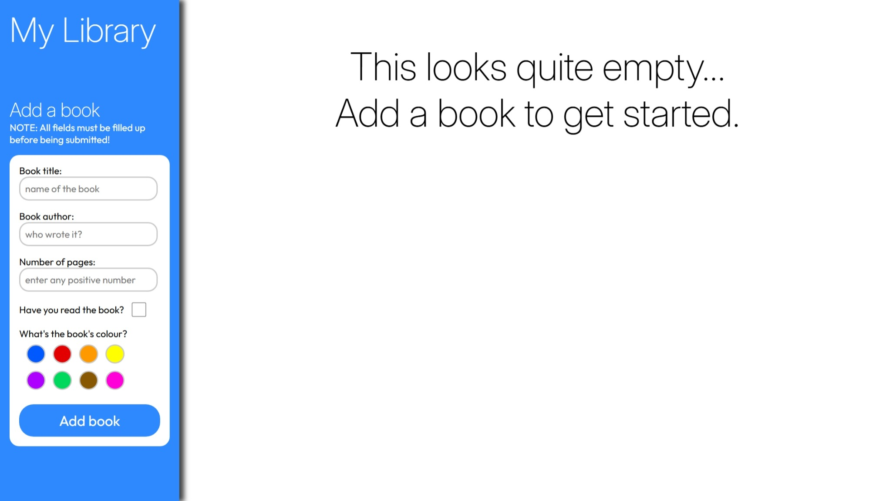
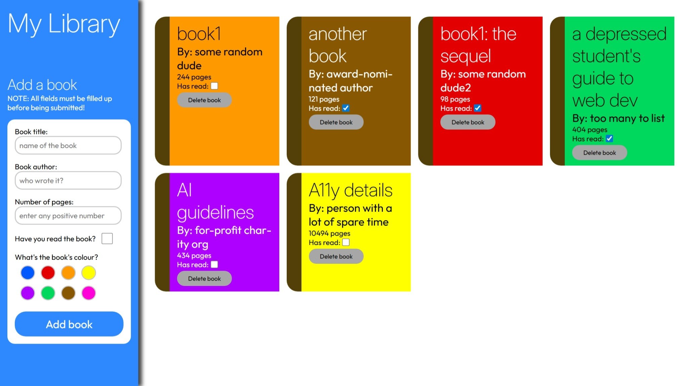
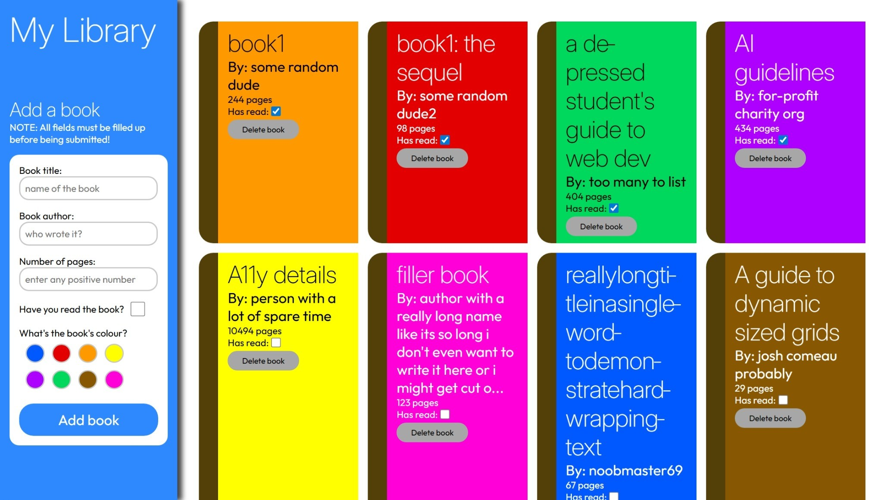

# library
Library project based on The Odin Project curriculum.

## Technologies used:
 - HTML for basic page layout
 - CSS for styling elements and use of web fonts (Inter for headings, Outfit for body text)
 - CSS Grid and Flexbox for arranging elements
 - JavaScript for handling logic of adding books, editing read status and deleting books
 - Git for version control

 ## Key features:
 - Books can be added by filling up the form in the sidebar
 - Books can be deleted, and their read status can be toggled
 - Books automatically arrange themselves in the content (right) area

 ## Gallery:
 
 
 